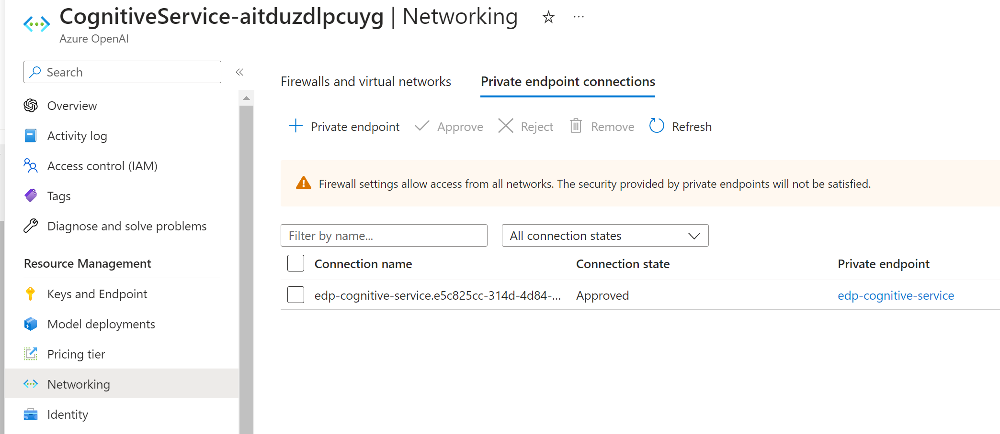

# CognitiveServiceDemo
## requirement
Our goal is to set up an Azure Cognitive Services account and deploy a language model into it. The
environment needs to be created in a reproducible manner, in our case scripted in Terraform.
Please complete the following draft so that a secure Azure Cognitive Services account gets created
and the “gpt-35-turbo” model gets deployed. Make sure that the API is only accessible via private
Endpoint.

Cognitive search service created and “gpt-35-turbo” model gets deployed.

private endpoint connection to the cognitive service

Some higlights
1.	Github action to support CI/CD IaC pipeline. Code will be automatically deployed to azure
2.	Pre-commit check to improve coding efficiency.
3.	Backend using remote one, resides on azure
4.	Tagged well for better resource inventory
5.	Private zone and private endpoint/url supported.
